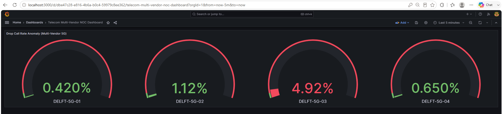
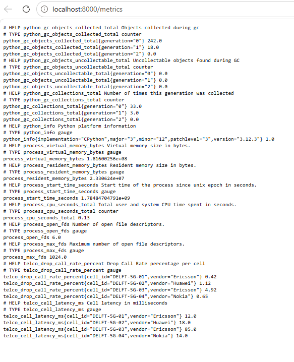

# 📡 Cloud-Native Telecom Integration Platform (Telco Telemetry & AI Observability)

[](https://opensource.org/licenses/MIT)
[](https://kubernetes.io/)
[](https://www.mulesoft.com/)
[](https://kafka.apache.org/)
[](https://www.python.org/)

An end-to-end **Cloud-Native Telecom OSS Integration Platform** designed to ingest, transform, stream, and monitor multi-vendor 5G Radio Access Network (RAN) telemetry metrics in real time.

The platform leverages **MuleSoft 3-Tier API-Led Connectivity**, **Apache Kafka Event Streaming**, **AI/ML Anomaly Detection with Root Cause Analysis (RCA)**, and automated **Prometheus + Grafana NOC Observability**.

---

## 🏗️ High-Level Architecture

```text
┌────────────────────────────────────────────────────────────────────────────────────────┐
│                                 MULTI-VENDOR OSS SOURCES                               │
│     [Ericsson ENM]              [Huawei U2020]               [Nokia NetAct]            │
└──────────┬─────────────────────────────┬────────────────────────────┬──────────────────┘
           │                             │                            │
           ▼                             ▼                            ▼
┌────────────────────────────────────────────────────────────────────────────────────────┐
│                            LAYER 1: SYSTEM API (MuleSoft 4)                            │
│  - Normalizes raw vendor DB/API schemas (TM Forum TMF628 PM standard)                  │
└────────────────────────────────────────┬───────────────────────────────────────────────┘
                                         │
                                         ▼
┌────────────────────────────────────────────────────────────────────────────────────────┐
│                           LAYER 2: PROCESS API (MuleSoft 4)                            │
│  - DataWeave 2.0 KPI aggregations, threshold evaluations, & payload routing            │
└────────────────────────────────────────┬───────────────────────────────────────────────┘
                                         │
                                         ▼
┌────────────────────────────────────────────────────────────────────────────────────────┐
│                        EVENT BUS & STREAMING (Apache Kafka KRaft)                      │
│  - Topic: `telco.ran.kpi.transformed`  |  Dead Letter Queue: `telco.ran.kpi.dlq`       │
└──────────┬──────────────────────────────────────────────────────────┬──────────────────┘
           │                                                          │
           ▼                                                          ▼
┌──────────────────────────────────────┐            ┌────────────────────────────────────┐
│   LAYER 3: AI ANOMALY DETECTION ENGINE   │        │   PROMETHEUS EXPORTER & OBSERVABILITY │
│ - Real-time Kafka Consumer           │            │ - Pulls cell KPIs into metrics     │
│ - Anomaly Isolation & LLM RCA        │            │ - Serves metrics on port :8000     │
│ - Triggers Remediation Webhooks      │            │ - Auto-provisioned Grafana NOC     │
└──────────────────┬───────────────────┘            └─────────────────┬──────────────────┘
                   │                                                  │
                   └─────────────────────────┬────────────────────────┘
                                             │
                                             ▼
┌────────────────────────────────────────────────────────────────────────────────────────┐
│                         EXPERIENCE API / NOC DASHBOARD / ALERTING                      │
└────────────────────────────────────────────────────────────────────────────────────────┘
```

---

## 🧰 Technology Stack

| Category | Technologies / Frameworks |
| :--- | :--- |
| **Integration Layer** | MuleSoft Anypoint Platform (System API, Process API, Experience API), DataWeave 2.0, RAML 1.0, TM Forum APIs |
| **Event Streaming** | Apache Kafka (KRaft mode), Kafka Console Producers/Consumers, Multi-Partition Topics |
| **Database & Storage** | PostgreSQL (Telco Telemetry Store) |
| **AI & Anomaly Engine** | Python 3.10, Stream Parser, Rule-based Anomaly Scoring, Synthetic LLM RCA Engine |
| **Observability** | Prometheus, Grafana NOC Dashboard (Auto-provisioned Gauges), Custom Python Exporter |
| **Container & IaC** | Kubernetes (Minikube/k8s), Docker, Terraform |
| **DevSecOps & CI/CD** | GitHub Actions, Trivy Security Scanner, Python \`unittest\` E2E Test Suite |

---

## 📸 Real System Execution & Verification

### 1. Multi-Vendor Ingestion & Database Initial State (Phase 1)
Structured KPI telemetry injected into PostgreSQL database representing Ericsson, Huawei, and Nokia gNodeB cells:

```text
   cell_id   |  vendor  | drop_call_rate | is_critical 
-------------+----------+----------------+-------------
 DELFT-5G-01 | Ericsson |           0.42 | f
 DELFT-5G-02 | Huawei   |           1.12 | f
 DELFT-5G-03 | Ericsson |           4.92 | t
 DELFT-5G-04 | Nokia    |           0.65 | f
(4 rows)
```

### 2. MuleSoft DataWeave 2.0 Transformation (Phase 2)
Raw multi-vendor metrics normalized into canonical JSON model with threshold evaluations:

```json
{
  "eventHeader": {
    "eventType": "RAN_KPI_TELEMETRY_INGESTION",
    "apiVersion": "v2.0"
  },
  "telemetryData": [
    {
      "cellId": "DELFT-5G-01",
      "vendor": "Ericsson",
      "metrics": { "dropCallRate": 0.42, "latency": 12 },
      "status": "NORMAL"
    },
    {
      "cellId": "DELFT-5G-03",
      "vendor": "Ericsson",
      "metrics": { "dropCallRate": 4.92, "latency": 85 },
      "status": "CRITICAL_ANOMALY"
    }
  ]
}
```

### 3. Kafka Event Streaming Verification (Phase 3)
Provisioned \`telco.ran.kpi.transformed\` and DLQ topics, successfully streaming transformed payload across the event bus:

```text
🚀 Creating Enterprise Kafka Topics in K8s Cluster...
Created topic telco.ran.kpi.transformed.
Created topic telco.ran.kpi.dlq.
✅ Kafka Topics successfully provisioned.
```

### 4. AI Anomaly Engine & LLM Root Cause Analysis (Phase 4)
Real-time stream parser triggering automated alert & closed-loop remediation webhook for critical cell anomalies:

```text
🤖 Starting AI Anomaly Detection Engine (Listening to Kafka Stream)...

📊 [KPI CHECK] Cell: DELFT-5G-01 | Vendor: Ericsson | DCR: 0.42% | Latency: 12ms
📊 [KPI CHECK] Cell: DELFT-5G-02 | Vendor: Huawei   | DCR: 1.12% | Latency: 18ms
📊 [KPI CHECK] Cell: DELFT-5G-03 | Vendor: Ericsson | DCR: 4.92% | Latency: 85ms

🚨🚨🚨🚨🚨🚨🚨🚨🚨🚨🚨🚨🚨🚨🚨🚨🚨🚨🚨🚨
⚠️ [AI ANOMALY ALERT] High Drop Call Rate Spike detected on DELFT-5G-03 (Ericsson)!
📈 Measured DCR: 4.92% (Threshold: 3.0%) | Latency: 85ms
🧠 [LLM Root Cause Analysis]: Hardware interface degradation or high RF interference post-DataWeave transformation.
📢 [CLOSED-LOOP ACTION] Triggering automated remediation webhook to Experience API for DELFT-5G-03...
🚨🚨🚨🚨🚨🚨🚨🚨🚨🚨🚨🚨🚨🚨🚨🚨🚨🚨🚨🚨
```

### 5. Automated End-to-End Health Check (Phase 6)
All system layers validated in **3.79 seconds**:

```text
🔍 Running Verbose End-to-End Telecom Platform Health Checks...
[DB] Verify Postgres Multi-Vendor Telemetry Table Ingestion ... ok
[KAFKA] Verify Kafka Event Streaming Topics Provisioning ... ok
[K8S] Verify Prometheus & Grafana Monitoring Pods Status ... ok

----------------------------------------------------------------------
Ran 3 tests in 3.791s

OK
```

### 6. Prometheus & Grafana NOC Observability (Phase 5)
Custom Python Prometheus exporter scraping real-time cell KPIs and powering auto-provisioned Grafana NOC dashboards:

#### 📊 Grafana NOC Dashboard:


#### 📈 Prometheus Telemetry Metrics Endpoint (:8000):


---

## ⚡ Quick Start & Local Deployment

### Prerequisites
* WSL 2 (Ubuntu) / Linux
* Kubernetes Cluster (Minikube / Kind / K8s)
* Python 3.10+ & \`kubectl\`

### Deployment Steps
```bash
# 1. Clone repository
git clone https://github.com/tmwaas/telecom-integration-platform.git
cd telecom-integration-platform

# 2. Setup Virtual Environment
python3 -m venv .venv
source .venv/bin/activate
pip install prometheus_client

# 3. Start Infrastructure & Monitoring
./scripts/start-monitoring.sh

# 4. Trigger AI Detection Engine
./scripts/run-ai-engine.sh

# 5. Execute Full E2E Health Check
./scripts/health-check.sh
```

---

## 🛡️ License
This project is licensed under the MIT License.